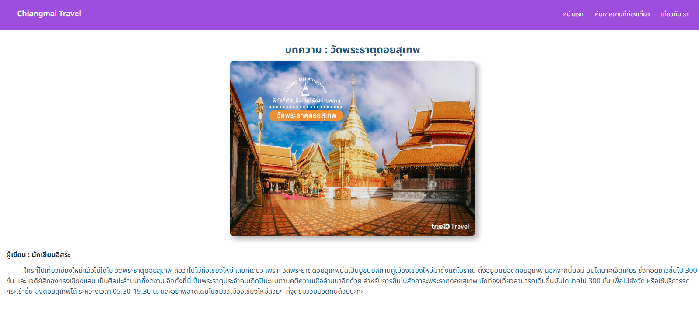

# Chiangmai-Travel

Web application for training in using React Router v.6 by searching for tourist attractions within Chiang Mai province. through Thai letters If you search for any letter Content that contains that character will appear

Links Solution URL: [https://github.com/hedisnice/Chiangmai-Travel]

Live Site URL: [https://chiangmai-travel.netlify.app/]
